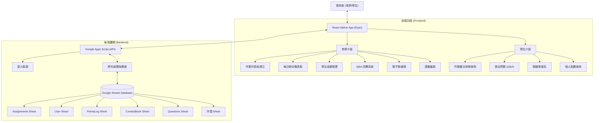

# APP Final Project: 智慧作業管理平台 (Smart Homework Manager)

## 1. 平台開發背景、動機、目的 (Background, Motivation, Purpose)

### 背景 (Background)
本專案的開發靈感來自於我的姊姊，她是一位國小老師。她每天除了教學，還需花費大量時間批改與登記作業，紙本紀錄不僅繁瑣且難以統計；此外，家長常因無法即時得知作業內容或孩子缺交狀況（資訊不對稱），導致無法有效在家督促孩子。

### 動機 (Motivation)
我希望透過數位化的方式，解決「作業追蹤困難」與「親師溝通成本高」的痛點。利用手機 App 便攜的特性，結合 Google Sheets 易於管理的後端資料庫，打造一個輕量級且高效的作業管理系統。

### 目的 (Purpose)
- **即時追蹤**：老師可隨時查看全班缺交、訂正狀況。
- **自動化統計**：系統自動篩選當日應繳作業，並計算缺交名單。
- **高效溝通**：一鍵生成催繳訊息，減少老師打字負擔。
- **雙向互動**：學生或家長可針對作業提問，老師即時回覆。

---

## 2. 平台功能架構圖 (Functional Architecture)

---

## 3. 各功能畫面導覽 (Screen Tour)

### 老師端 (Teacher)
1.  **首頁/儀表板 (Dashboard)**：
    *   **每日摘要**：顯示當天截止的作業及缺交學生名單 (座號)。
    *   **快速入口**：提供所有功能的快捷按鈕（建立作業、批改、掃描等）。
2.  **作業列表 (Assignment List)**：
    *   查看所有已建立的作業，並可點擊進入「繳交狀態」頁面進行批改。
    *   **修改作業**：可針對已發布的作業修改說明內容 (Edit Assignment)。
3.  **作業建立 (Create Assignment)**：
    *   設定作業名稱、開始/結束日期、說明。
    *   系統自動為全班建立繳交紀錄欄位。
4.  **繳交狀態與評分 (Status & Grading)**：
    *   列表顯示單一作業的所有學生繳交情形 (已繳交/未繳交/訂正)。
    *   **評分功能**：點擊即可輸入成績，即時同步至後端。
    *   **催繳功能**：一鍵生成給家長的提醒訊息模板。
5.  **問答管理 (Q&A)**：
    *   查看學生針對特定作業的提問並進行回覆，解決學生疑惑。
6.  **電子聯絡簿 (Contact Book)**：
    *   發布班級事項，並即時查看全班的已讀/簽名狀態。
7.  **獎勵集點 (Give Points)**：
    *   針對表現優良的學生發放點數，可一次選取多位學生進行獎勵。
8.  **QR Code 掃描 (Scanner)**：
    *   掃描學生作業上的 QR Code，快速辨識學生讓繳交狀態可以快速輸入。

### 學生端 (Student)
1.  **首頁 (Home)**：
    *   **學習概況**：透過 Widget 查看個人點數 (Points) 與待辦作業數量。
    *   **通知中心**：接收新作業發布通知，點擊可直接跳轉。
2.  **我的作業 (My Assignments)**：
    *   查看作業列表及自己的繳交狀態 (分數、是否需訂正)。
3.  **提問系統 (Question)**：
    *   針對作業提問，並查看歷史問答紀錄。
4.  **電子聯絡簿 (Contact Book)**：
    *   查看老師發布的聯絡事項。
    *   **電子簽名**：閱讀後點擊簽名按鈕，系統會記錄簽收時間並回傳給老師。
5.  **學習分析 (Analysis)**：
    *   查看個人作業繳交率與獲得的總點數圖表。

---

## 4. 平台使用 View 頁面介紹

本平台採用 React Native 的元件化設計，共實作 17 個 Screen 元件，各司其職：

### 共用/基礎頁面 (Common)
- **`LoginScreen`**: 登入頁面。處理使用者認證，整合 `useAuth` Hook 進行狀態管理。
- **`HomeScreen`**: 首頁。根據使用者身分 (`teacher`/`student`) 動態渲染對應的 Dashboard Widget (如今日狀態、點數概況)。
- **`SettingsScreen`**: 設定頁面。提供主題切換 (`light`/`dark`) 與個人資料顯示。
- **`NotificationScreen`**: 通知中心。彙整未讀的作業發布或問答回覆通知，支援下拉更新 (`RefreshControl`)。

### 老師端功能頁面 (Teacher Screens)
- **`TeacherDashboardScreen`**: 老師主控台。快捷入口與「今日缺交摘要」卡片的展示核心。
- **`AssignmentListScreen`**: 作業列表。展示所有作業，支援日期篩選與狀態概覽。
- **`CreateAssignmentScreen`**: 建立作業。提供日期選擇器 (`DateTimePicker`) 與表單輸入。
- **`EditAssignmentScreen`**: 修改作業。允許老師編輯已發布作業的說明與期限。
- **`StatusDashboardScreen`**: 繳交狀態監控。核心功能頁，支援對全班學生的即時評分、狀態切換與催繳訊息生成。
- **`GivePointsScreen`**: 獎勵集點。多選學生名單 (`Multi-select`) 並發放獎勵點數。
- **`TeacherQnAScreen`**: 問答管理。老師查看學生提問並進行回覆的介面。
- **`ContactBookScreen`**: 電子聯絡簿。老師發布聯絡事項，並可監控學生的簽名狀態。
- **`ScannerScreen`**: QR Code 掃描。整合相機模組，支援連續掃描作業代碼並快速送出繳交紀錄。
- **`ResultScreen`**: 結果回饋。通用頁面，用於顯示操作成功或失敗的詳細訊息 (如掃描結果、提交確認)。

### 學生端功能頁面 (Student Screens)
- **`StudentAssignmentListScreen`**: 學生作業列表。針對學生視角優化，清楚標示缺交、訂正與已完成的作業。
- **`QuestionScreen`**: 提問系統。針對特定作業進行師生對話，以聊天室形式呈現歷史紀錄。
- **`AnalysisScreen`**: 學習分析。視覺化呈現學生的作業繳交統計與累積點數。

---

## 5. 程式碼各個區段功能說明 (Code Structure & Functionality)
本專案採前後端分離架構，前端為 React Native，後端為 Google Apps Script。

### 前端架構 (Frontend - React Native)

#### 1. API 通訊層 (`src/api/`)
*   **`sheetApi.js`**: 負責與後端溝通的核心模組。
    *   **`apiCall(action, payload)`**: 統一的呼叫介面。接受 `action` (如 `login`, `getAssignments`) 與參數，並回傳 Promise。
    *   **環境判斷與 Mock 機制**: 自動偵測 `Platform.OS`。若為 `web` 環境且偵測到 Google Script URL (會有 CORS 問題)，則自動攔截請求並回傳本地的 Mock Data，極大化提升開發與測試效率。
    *   **Action Logging**: 實作了攔截器 (Interceptor) 概念，在 Console 詳細紀錄每一個 Request 的 Action 與 Payload，以及 Response 結果，方便除錯。

#### 2. 狀態管理 (`src/context/`)
使用 React Context API 進行全域狀態管理，避免層層傳遞 props (Prop Drilling)。
*   **`AuthContext.js`**:
    *   **`login(studentId, password)`**: 呼叫 API 驗證身分，成功後將使用者資訊存入 `AsyncStorage` 實現持久化登入。
    *   **`logout()`**: 清除 `AsyncStorage` 並重置狀態。
*   **`ThemeContext.js`**:
    *   負責管理 App 主題 (`light`/`dark`/`system`)。提供 `useTheme` Hook，讓所有元件能即時存取目前的顏色定義 (Colors) 與排版樣式 (Typography)。

#### 3. 畫面與樣式分離 (`src/screens/` & `src/styles/`)
為了保持程式碼整潔，我們將「邏輯」與「樣式」完全分離。
*   **Screens**: 只專注於資料獲取 (`useEffect`)、事件處理 (`handlePress`) 與 UI 渲染結構。
*   **Styles**: 所有的 `StyleSheet` 定義都依照 Screen 名稱獨立存放在 `src/styles/` 資料夾。
    *   **Theme-Aware**: 樣式檔皆為 Function (如 `getScannerScreenStyles(theme)`)，接受當前的主題物件，動態回傳對應的顏色樣式，確保暗黑模式 (Dark Mode) 完美運作。

---

### 後端架構 (Backend - Google Apps Script)

後端邏輯部署於 Google Apps Script，作為連接 App 與 Google Sheets 的橋樑。

#### 1. 請求分派 (Dispatcher)
*   **`doPost(e)`**: 
    *   程式的單一入口點。
    *   解析 JSON 格式的 Payload。
    *   使用 `switch(action)` 語句，根據前端傳來的指令 (Commad Pattern)，將請求分派給對應的處理函式 (Handler)。

#### 2. 核心商業邏輯 (Business Logic)
*   **`handleGetDailySummary` (每日儀表板)**:
    *   **演算法**: 
        1. 取得「今天截止」的所有作業。
        2. 取得全班學生名單 (Map)。
        3. 針對每一份作業，查詢 `Status Sheet` 取得已繳交名單。
        4. 執行 `Set` 差集運算 (Total - Submitted = Missing)，快速計算出缺交學生列表。
*   **`handleGetStudentStats` (學習分析)**:
    *   **聚合運算**: 遍歷 `Status Sheet` 計算特定學生的缺交總數與平均分數；同時查詢 `PointsLog Sheet` 加總該學生的歷史點數，回傳給前端繪製圖表。
*   **`handleUpdateGrade` (即時評分)**:
    *   **精準寫入**: 根據 `studentId` 與 `assignmentId` 建立唯一的 Key，在 Spreadsheet 中快速定位列號 (Row Index)，只更新特定儲存格，避免覆蓋其他資料。
#### 3. 資料庫設計 (Database - Google Sheets)
直接使用 Google Sheets 作為 資料儲存層，主要包含以下工作表：
*   **Assignments Sheet**: 儲存作業的中繼資料 (ID, 標題, 截止日, 說明)。
*   **User Sheet**: 存儲使用者資料(UserID、姓名、角色、班級、號碼)。
*   **PointsLog Sheet**: 記錄獎勵點數的變動歷程 (學生, 點數, 原因, 時間)。
*   **ContactBook Sheet**: 儲存電子聯絡簿的發文內容與學生的簽名狀態。
*   **Questions Sheet**: 儲存學生的問答內容。
*   **作業 Sheet (Data)**: 用於儲存作業的原始資料(學生ID、繳交狀態、日期、學生姓名、分數)。